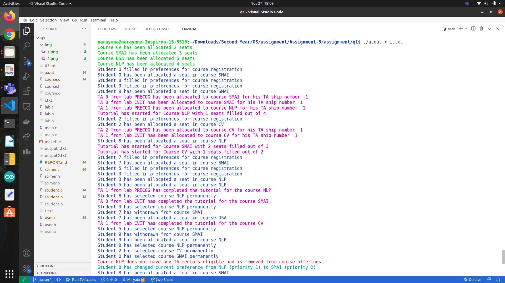
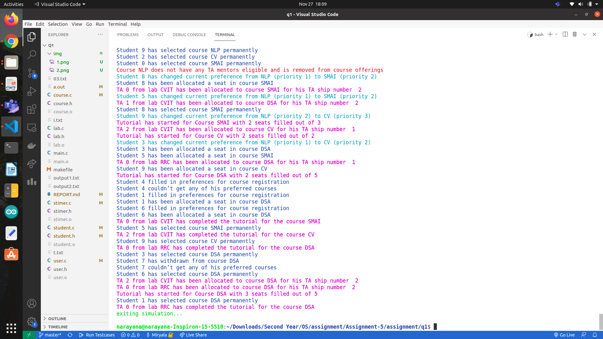

# An alternate course allocation Portal

folder structure

```
   q1
    |
    |______ main.c 
    |
    |______ user.c & user.h 
    |
    |______ course.c & course.h 
    |
    |______ student.c & student.h 
    |
    |______ lab.c & lab.h
    |
    |______ stimer.c & stimer.h
    |
    |______ Makefile
    |
    |______ some .txt files

```

## **main.c** 
- initalizes **stimer_lock** and **stimer_cond** globally and calls init_all_threads() in main function


## **user.c**
- takes input
- creates
    - **course_list [ ]** - list of **struct course** 
    - **student_list [ ]** - list of **struct student**
    - **lab_list [ ]** - list of **struct lab**
- create thread for each course with **simulate_course** function as thread function having **&course** as argument
- create thread for each student with **simulate_student**
 function as thread function having **&student** as argument
- no threads for labs part
- start the simulation by simulate_timer() passing time of simulation as argument
- after time is over send SIGINT to the program and kill it


## **course.c**
- **``registered_for_course(i)``**
    - returns true if student could register to the course number i
    - increaments **student_count** if it is less then course **course_max_slot**
- **``withdrawn_from_course(i)``**
    - decreaments **student_count** if it is > 0
- **``simulate_course()``**
    - wait for the stimer to turn 0 using pthread_cond_wait on stimer_cond
    - then wait for atleat one student to register for the course conditional wait on **student_cnt_cond**
    - then search for TA to allocate
        - if TA is not found 
            - remove course ... by setting **course_x->in_simulation** to false;
        - if TA is found 
            - start conducting tutorial.
            - inform all students registered to this course that tutorial is being to be conducted.
            - make the TA free
    - tutorial over
    - wait for new student(s) to register


## **student.c**

- **``simulate_student()``**
    - student waits for his time to register
    - register with preferences
    - registered for 1st preference
        - wait for tutorial to be over
        - if his prob < MIN_PROB_OF_LIKING_COURSE
            - withdraw from course
            - register for 2nd preference
        - else 
            - select course permanently
            - wait till course is removed due to unavailabe TAs
    - repeat similar steps as above 1st preference steps for 2nd and 3rd preferences
    - if no course is selected exit simulation

## **lab.c**
- no threads used in it 
- header **lab.h** needed for 
    - **struct lab** 
    - **struct ta**
    - **lab_list**


## **stimer.c**
- **`simulate_timer()`**
    - for every one second **SIGALARM** is raised by **alarm(1)** and it is handled by a function **increament_timer()** function
    - also exits if all students are allocated one of their preference or out of simulation.
- **`increament_timer()`**
    - increaments **stimer** by 1.
    - sends a broadcast signal to all threads waiting on **stimer_cond**.


